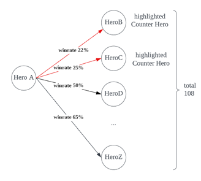

SI508 final project py Pengyu Yang 
Dota2 banpick helper 
 
Get Started: 
Required packages:ast, tkinter & requests. 
 
 
To get your own API keys, go to https://steamcommunity.com/dev/apikey and signin with your steam account. Then replace the API keys. 
To run the program, open “Starter.py” with python.py or use command line python3 final_project.py 
To use the program, simply press the buttons to load or get the records. Use the drop-down menu to select the Heroes and see their counter results. 
 
 
how to interact: 
- Get new records from API: press button “getMatchesSteam” or “getMatchesOpenDota” depending on which sources you want. To get very large number of records, use the scale to set the number and press “getLargeMatchesSteam”
* Load the cached records: press button “load from file” or “load from OpenDotaAPI” depending on which sources you want.
+ Use the drop-down menu to select the Hero. The program will show the counter Heroes. Click on the counter Hero jumps to provide counters for that counter Hero.
* save the results: press: press ”save to file” button. Then press “STOP” to exit

